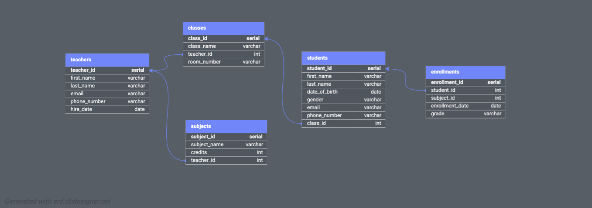

## Database Structure

### PostgreSQL (SQL Database)
1. **Teachers** - Teacher information
2. **Classes** - Class details
3. **Subjects** - Subject information
4. **Students** - Student records
5. **Enrollments** - Student-subject enrollments



### MongoDB (NoSQL Database)
1. **Teachers** - Teacher information (similar to PostgreSQL)
2. **Classes** - Class details (similar to PostgreSQL)
3. **Students** - Student records (similar to PostgreSQL)
4. **LibraryBooks** - Library book management (MongoDB only)
5. **Events** - School events (MongoDB only)

**Note**: Teachers, Classes, and Students exist in both databases and can be joined. LibraryBooks and Events are MongoDB-specific collections.

## Project Structure

```
assignment4/
├── backend/                 # Node.js/Express backend
│   ├── config/            # Database configuration
│   ├── routes/            # API routes
│   ├── services/          # Database abstraction layer
│   ├── server.js          # Main server file
│   └── package.json
├── frontend/              # React frontend
│   ├── src/
│   │   ├── components/   # React components
│   │   ├── services/     # API service layer
│   │   └── App.js
│   └── package.json
├── database/
│   ├── postgres/         # PostgreSQL initialization
│   └── mongodb/          # MongoDB initialization
└── docker-compose.yml     # Docker configuration
```

## Prerequisites

- Docker and Docker Compose installed
- Ports 3000, 3001, 5432, and 27017 available

## Getting Started

### 1. Clone the project

```bash
git clone https://github.com/ducnguyenlut/data_intensive_assignment4.git
```

### 2. Start all services with Docker Compose

```bash
docker-compose up --build
```

This will:
- Start PostgreSQL database on port 5432
- Start MongoDB database on port 27017
- Start backend API on port 3001
- Start frontend application on port 3000

### 3. Access the application

- **Frontend**: Open your browser and navigate to `http://localhost:3000`
- **Backend API**: Available at `http://localhost:3001`
- **API Health Check**: `http://localhost:3001/health`

### 4. Stop the services

```bash
docker-compose down
```

To remove volumes (database data):

```bash
docker-compose down -v
```

## API Endpoints

### Get Data
- `GET /api/:entityType` - Get all entities (supports `?view=all|postgres|mongodb|combined`)
- `GET /api/:entityType/join` - Join similar entities from both databases

### Create Data
- `POST /api/:entityType` - Create new entity (automatically routes to appropriate database)

### Update Data
- `PUT /api/:entityType/:id` - Update entity (automatically routes to appropriate database)

### Delete Data
- `DELETE /api/:entityType/:id` - Delete entity (automatically routes to appropriate database)

## Troubleshooting

### Port conflicts
If ports are already in use, modify the port mappings in `docker-compose.yml`

### Database connection issues
- Ensure all containers are running: `docker-compose ps`
- Check logs: `docker-compose logs backend`
- Restart services: `docker-compose restart`

### Frontend not loading
- Wait for the React development server to start (may take 30-60 seconds)
- Check browser console for errors
- Verify backend is running: `curl http://localhost:3001/health`

## Development

### Running without Docker

1. **Backend**:
   ```bash
   cd backend
   npm install
   npm start
   ```

2. **Frontend**:
   ```bash
   cd frontend
   npm install
   npm start
   ```

3. **Databases**: Start PostgreSQL and MongoDB separately


